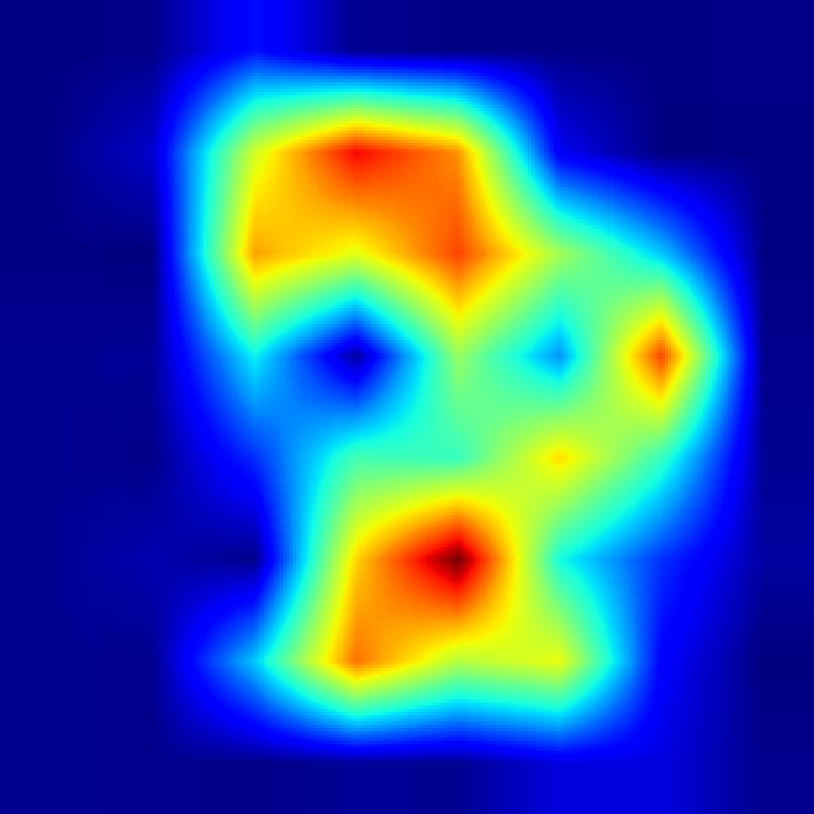
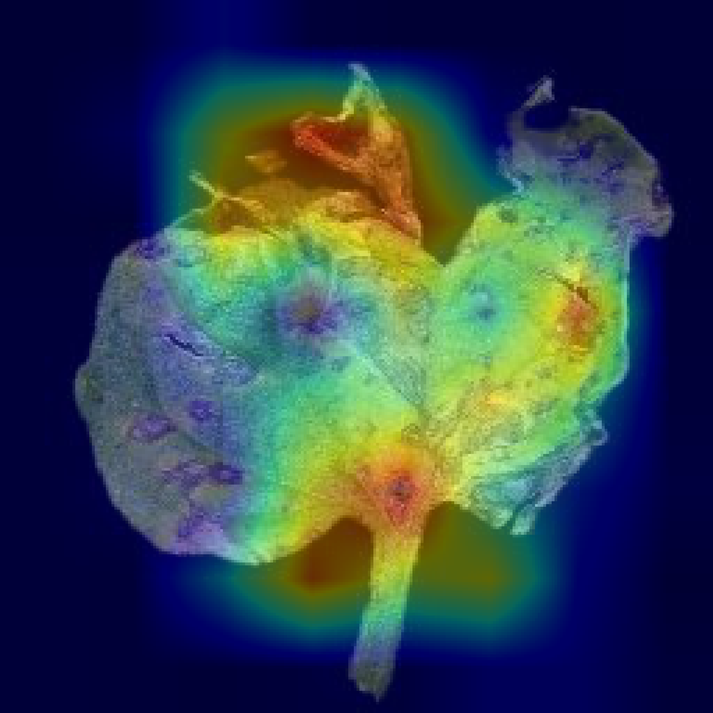
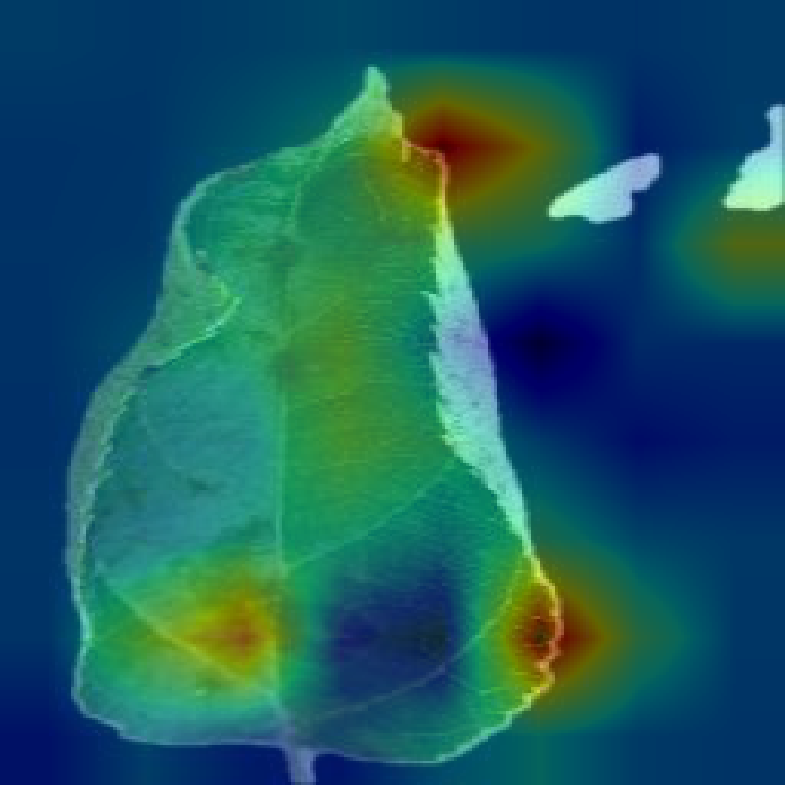
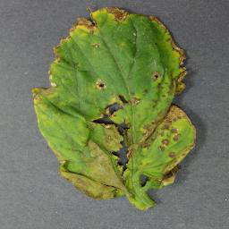
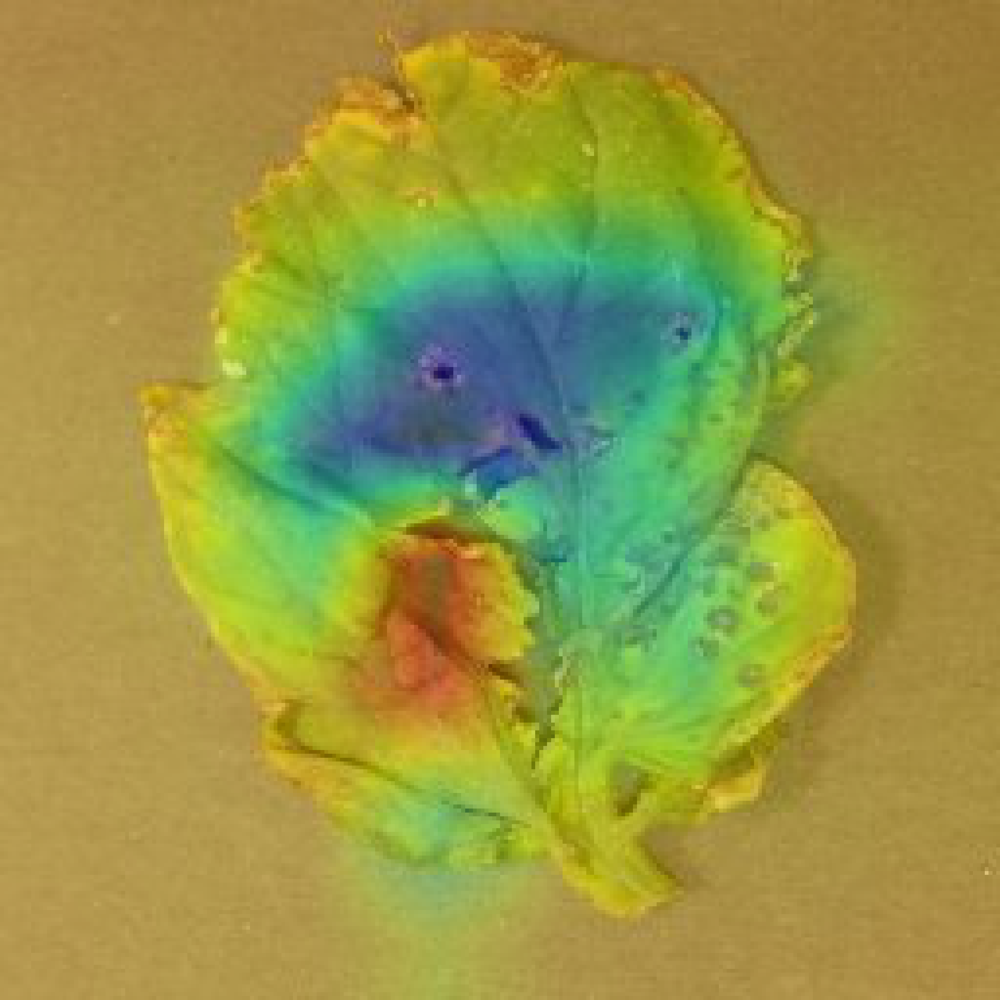

# Interpretable Plant Disease Classification through Multi-Attention Residual Loss Based Network

This project presents a deep learning framework for the classification of plant diseases, utilizing convolutional neural networks (CNNs) enhanced with a Multi-Attention Residual (MARes) loss function. To improve the transparency of predictions, explainable artificial intelligence (XAI) techniques are integrated, generating interpretable visualizations of model decisions.

## 1. Introduction

The early identification of plant diseases is vital for protecting agricultural yields and ensuring food security. Deep learning methods, particularly CNNs, have demonstrated effectiveness in automating plant disease recognition. However, the interpretability of these models remains a challenge. This work introduces a MARes loss-based approach, coupled with XAI, to enhance classification performance and model explainability.

## 2. Objectives

- Develop CNN models capable of binary classification between healthy and diseased plant leaves.
- Introduce a Multi-Attention Residual (MARes) loss function to improve feature learning.
- Generate visual explanations using GradCAM to interpret model decisions.
- Evaluate model generalization across datasets using cross-validation and external testing.

## 3. Model Architecture

The models are based on ResNet architectures (ResNet18, ResNet50, ResNet152), optionally incorporating Channel Attention modules. The classification layers are trained using the proposed MARes loss function to better capture disease-related features.

An overview of the architecture:


## 4. Datasets

Three datasets are utilized in this study:

- **Tomato Dataset**: Healthy and diseased tomato leaf images, organized for binary classification.
- **Apple Dataset**: Healthy and diseased apple leaf images, organized for binary classification.
- **PlantVillage Dataset**: Multi-crop plant images adapted for binary classification per species.

A data conversion script is provided to automate the grouping of multiple disease categories under a single "Diseased" label for each crop.

## 5. Preprocessing

All input images undergo the following preprocessing steps:

- Resizing to **224 × 224 pixels**.
- Normalization using ImageNet mean and standard deviation:
  - Mean: [0.485, 0.456, 0.406]
  - Standard Deviation: [0.229, 0.224, 0.225]

This ensures consistency across models and datasets.

## 6. Explainable AI (XAI) Visualizations

GradCAM is employed to produce heatmaps that highlight image regions most influential in classification decisions.

Representative examples:

| Original Image | Heatmap | Overlay Visualization |
|:--------------:|:-------:|:----------------------:|
|  |  |  |
|  |  |  |
|  |  |  |

## 7. Installation

Clone the repository and install the necessary dependencies:

```bash
git clone https://github.com/your_username/plant-disease-mares-xai.git
cd plant-disease-mares-xai

python3 -m venv venv
source venv/bin/activate

pip install -r requirements.txt
