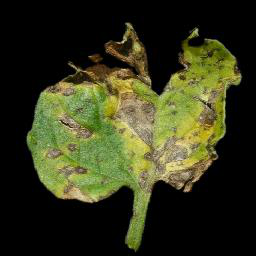
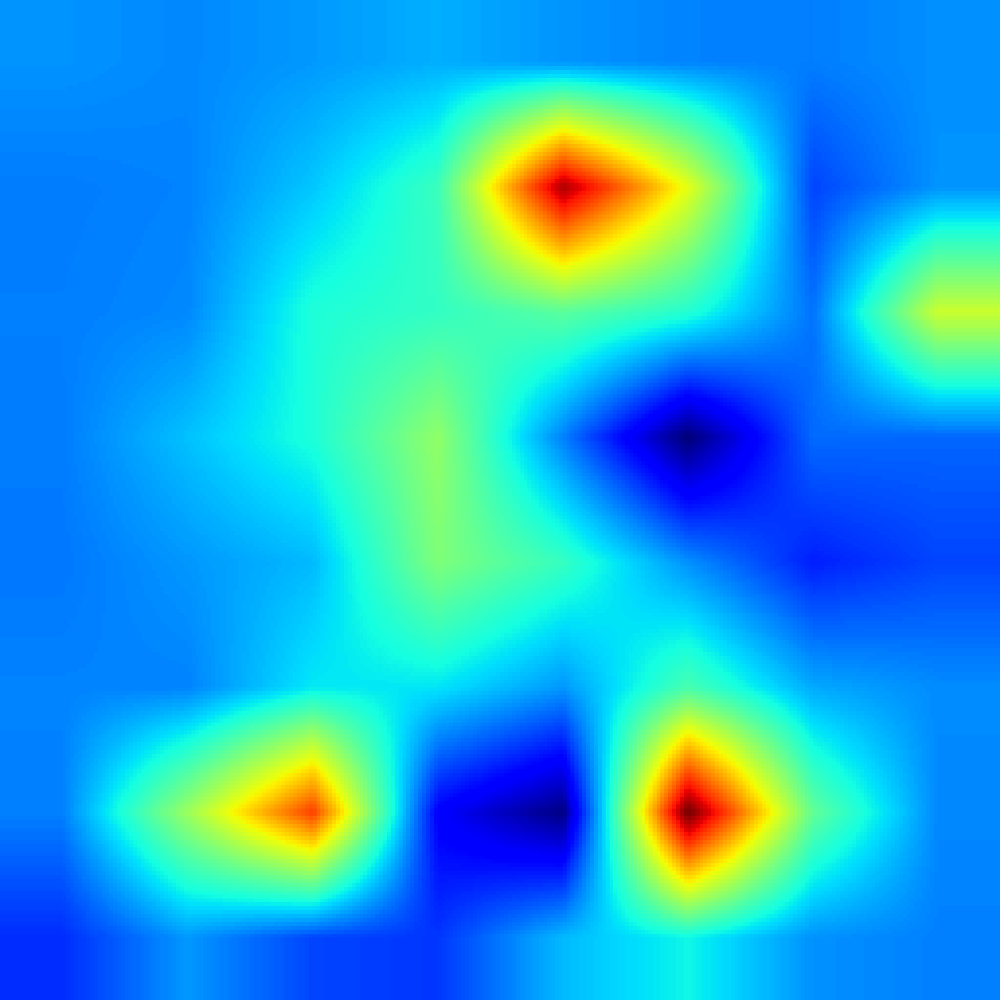

# Interpretable Plant Disease Classification through Multi-Attention Residual Loss Based Network

A deep learning framework for plant disease classification, enhanced by Channel Attention modules and optimized with a novel Multi-Attention Residual (MARes) loss function. The framework also integrates explainable AI (XAI) techniques such as GradCAM to visualize model predictions.

## About the Project

This project addresses the challenge of interpreting deep learning models for agricultural disease diagnosis.  
We propose CNN-based models integrated with attention mechanisms and a custom-designed MARes loss to improve both model performance and interpretability.

## Key Features

- Binary classification (Healthy vs Diseased) across Tomato, Apple, and PlantVillage datasets.
- Integration of attention modules into standard ResNet architectures (18, 50, 152 layers).
- Custom MARes Loss combining classification, skip supervision, and output regularization.
- GradCAM explainability pipeline for visual verification of model predictions.
- Support for cross-dataset generalization experiments and statistical evaluation.

---

## Model Overview

The core architecture is based on ResNet backbones, optionally enhanced with Channel Attention modules.  
Training uses the MARes loss, combining cross-entropy loss, residual feature supervision, and L2 regularization.


---

## Explainable AI (XAI) Visualizations

GradCAM is employed to produce heatmaps that highlight image regions most influential in classification decisions.

Representative examples:

| Original Image | Heatmap | Overlay Visualization |
|:--------------:|:-------:|:----------------------:|
|  |  |  |
|  |  |  |
|  |  |  |

---

## Datasets

Three datasets are utilized in this study:

- **Tomato Dataset**: Healthy and diseased tomato leaf images, organized for binary classification.
- **Apple Dataset**: Healthy and diseased apple leaf images, organized for binary classification.
- **PlantVillage Dataset**: Multi-crop plant images adapted for binary classification per species.

A data conversion script is provided to automate the grouping of multiple disease categories under a single "Diseased" label for each crop.

---

## Installation

Clone the repository and install the necessary dependencies:

```bash
git clone https://github.com/jaskaranksingh/MARes-Explainable-Plant-Disease-Identification.git
cd plant-disease-mares-xai

python3 -m venv venv
source venv/bin/activate

pip install -r requirements.txt
=======
